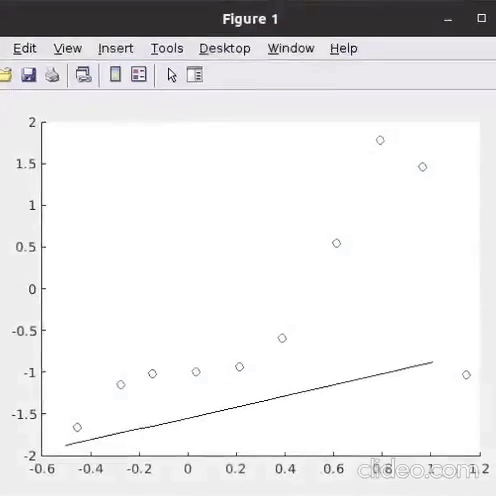

# matlab-newton-interpolation
A MATLAB implementation of of Newton interpolation
## Newton Interpolation
In the mathematical field of numerical analysis, a Newton polynomial, named after its inventor Isaac Newton, is an interpolation polynomial for a given set of data points.
### Output

